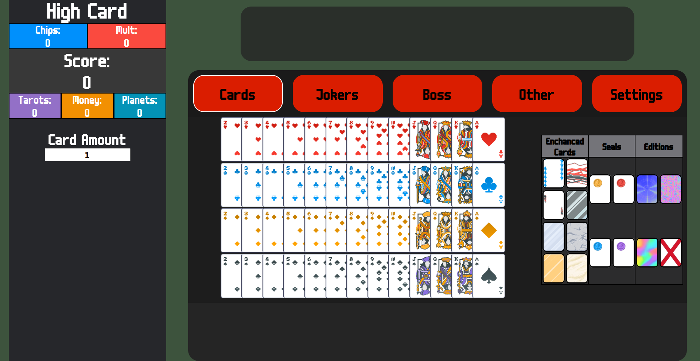
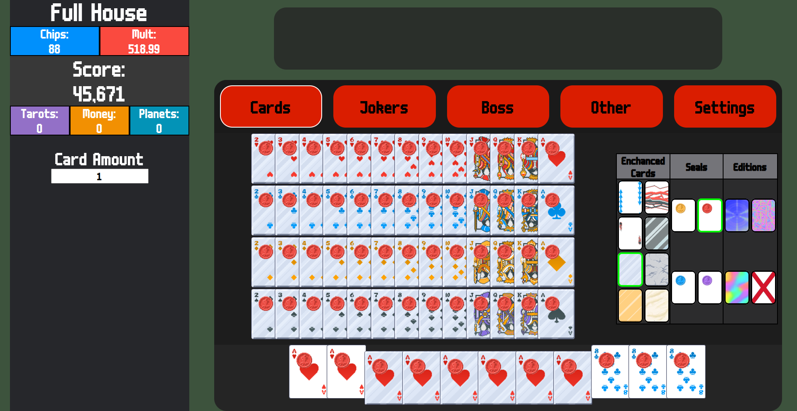

# BalatroCalculator

## What is Balatro Calculator?
Balatro Calculator is a website that checks the amount of chips you get from the scored hand you played

## Is the Project done?
The repository is still being worked on and it will not work well yet ||DO NOT USE IT FOR YOUR RUNS YET||

## What do I need to use this?
This project requires running on a local development server (it will not work by opening the file directly in a browser).  

If you are using Visual Studio Code, you can start a server with the **Live Server** extension.  
Alternatively, you can use any local server of your choice (e.g. `python -m http.server` in the project folder).

## Calculator screenshots

License: MIT